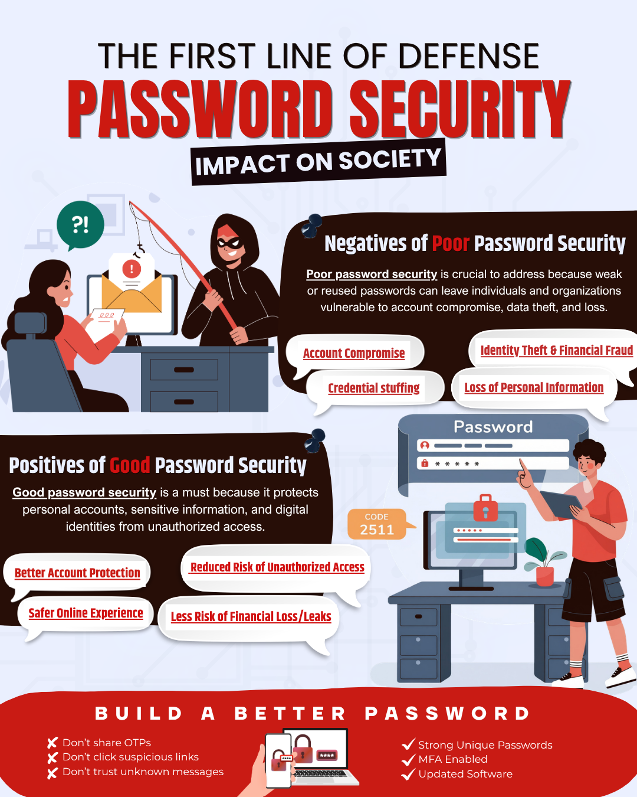

# Activity-2 - Manuel Jerard F Evangelista (BS-IT)


## Password Security

<p align="justify">
  The <strong>risk</strong> of accounts being compromised has been on the rise now more than ever. If you think you're one step ahead—more vigilant and none the wiser because you're caught up in the loop
  —<strong>heh</strong>... just remember, that bad actors, those operating in the shadows and in the dark corners of the web, have become more aware as well.
</p>

## Please Run Necessary Security Check...

```text
+--------------------------------------------------+
|      user@security:~$ ./protect_account          |
+--------------------------------------------------+

██████╗  █████╗ ███████╗███████╗██╗    ██╗ ██████╗ ██████╗ ██████╗
██╔══██╗██╔══██╗██╔════╝██╔════╝██║    ██║██╔═══██╗██╔══██╗██╔══██╗
██████╔╝███████║███████╗███████╗██║ █╗ ██║██║   ██║██████╔╝██║  ██║
██╔═══╝ ██╔══██║╚════██║╚════██║██║███╗██║██║   ██║██╔══██╗██║  ██║
██║     ██║  ██║███████║███████║╚███╔███╔╝╚██████╔╝██║  ██║██████╔╝
╚═╝     ╚═╝  ╚═╝╚══════╝╚══════╝ ╚══╝╚══╝  ╚═════╝ ╚═╝  ╚═╝╚═════╝ TM ;)

==================================================
                 TRUST NO PASSWORD
==================================================

        /!\  THE THREAT DOES NOT SLEEP  /!\

                 [ YOUR ACCOUNT ]
                        |
                        v
                 +-------------+
                 |   PASSWORD  |
                 +-------------+
                        |
                 +------+------+
                 |             |
                 v             v
          WEAK/REUSED     STRONG/UNIQUE
                 |             |
                 v             v
           COMPROMISED     PROTECTED
                 |             |
                 v             v
                [X]           [OK]


--------------------------------------------------
          LONG • UNIQUE • SECURE • 2FA
--------------------------------------------------


ACCESS: ████████████████░░  82%

> PASSWORD STATUS: SECURE
user@security:~$ _
```
## So What About The Infographic?
<p align="justify">
  It is absolutely, and I can't stress this enough, <strong>ABSOLUTELY CRUCIAL</strong> that people, especially the youth who are more active on social media now than ever, understand the must-dos of stronger password security and the precaution needed to make it stay that way.

  This is all about raising that awareness about the importance of password security, risks associated with the common password, and some practices that can help any user to <strong>better protect</strong> their accounts and most importantly, <strong>SAFEGUARD</strong> personal information.
</p>

<p align="justify">
  The second page illustrates the percentage of students enrolled in four select technology-related college courses: <strong>BS Information Technology (BSIT)</strong>, <strong>Information Systems (IS)</strong>, <strong>Computer Science (CS)</strong>, and <strong>Data Science (DS)</strong>. As such, the chart provides a quick overview of the estimated student distribution among the four chosen courses.
</p>

<p align="center">
  
</p>
